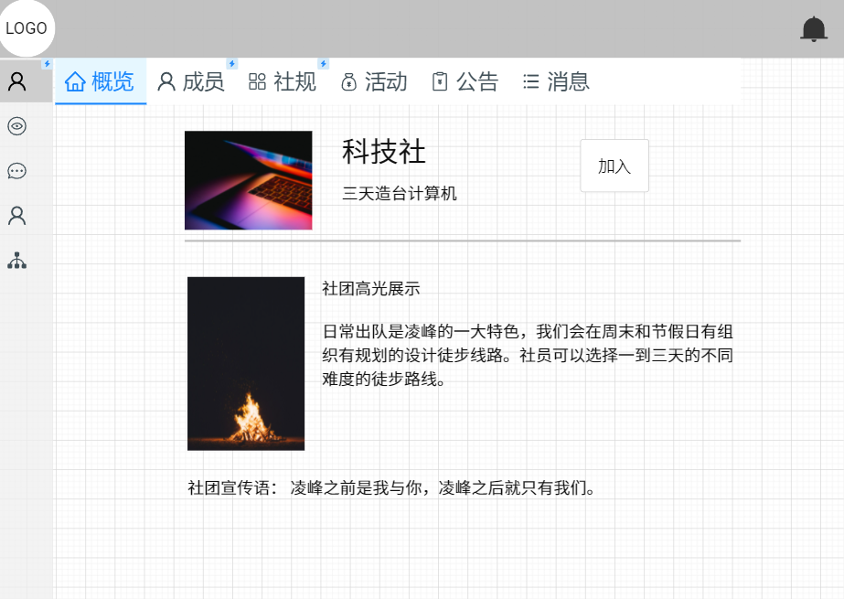

# 页面设计原型文档

陈俊杰 2022-11-04

加粗字体为实体

## 注册登录页面

仅作示意效果，注重交互性、注册验证码功能、背景图片

> 以下为管理系统的所有页面，整体页面布局：顶部、侧边栏（带隐藏与滑出功能）和主界面三部分，顶部显示用户头像、每日一语（欢迎词之类）、以及**消息**提醒功能。
>
> 注意关注实现的 所有 <列表> 组件，是前后端交互比较集中的地方，需要设计好接口

顶部、侧边栏、标签页

##  社团风采

本页面作为主页面，用意为夺人眼球

界面特点：轮播图、代表大类社团**新闻**图，点进去可以连接到对应社团的详情页

## 发现社团

支持 加入**社团**（没有真正的加入按钮，需要用户进入社团详情页）、搜索**社团**、创建**社团**等功能。

特点：社团简短信息展示 <列表1>，包括社团配图、社团名、社团简述（偏向于历史，展示成立时间等信息）、社团星级、社团标签等

特殊功能：搜索：按照用户输入的字符串进行 “模糊搜索”，如搜索 篮球，应出现 篮球社和篮球裁判社，之后出现的 种类 作为标签限定搜索，同时搜索结果应支持按某种方式**排序**

进入该界面用户可以浏览社团简述，如果感兴趣可以点击进入查看

创建社团会弹出相应表单由用户填写，并将表单数据收集传递给**团委老师**审核

> 数据导出：支持所有社团信息的导出

## 我的社团

我的社团属于一级导航栏，由于每个同学可能有多个社团，因此其下会设有多个子导航栏，以科技社为例，概览页面展示如下：

支持：概览、成员、社规查看、活动、公告、消息，其中部分功能只有正式社员才有资格参与，如参加活动，发表评论等功能

### 概览页面

包括社团特色照，社团高光展示，社团宣传语（吸引用户加入）

其中社团特色照旁会出现 加入（对于新用户）、退出（对于社员）按钮

### 成员页面

展示用户男女比可视化图表，展示 成员信息 <列表2>，包括姓名、职位、简介等。

成员展示需要分页展示

> 支持成员列表的导出

### 社规页面

显示社规的文字信息

### 活动页面

用户在该页面查看社团的历史活动，申请加入最新活动，评论建议未来活动

侧重的是风采展示和社员交流（评论功能）

### 公告页面

用户在该页面查看社团的最新通知（例如换届选举、新活动预热、社规更改、表彰等），侧重通知性

### 消息页面

用户在该界面查看最新自己发表评论收到的回复

## 个人中心

用户在该界面查看自己的个人信息，并可执行修改操作、**注销登录**操作

修改密码示意：

## 社团管理

社团管理等功能（**只有社长或社团骨干可见**）【包括：审核信息、发布公告、创建活动、修改社团信息、指定社团骨干、社长换届】

## 社团中心

社团级别的功能（只有**团委老师**可见）【包括社团申请审批、社团活动审批、社团星级审批】

